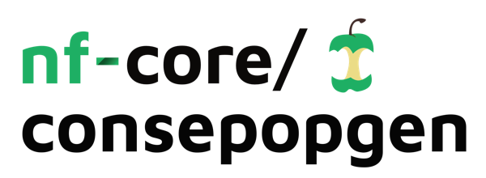

<h1>
  <picture>
    <source media="(prefers-color-scheme: dark)" srcset="docs/images/nf-core-consepopgen_logo_dark.png">
    
  </picture>
</h1>

[](https://github.com/Tylannn/consepopgen/actions/workflows/ci.yml)
[](https://github.com/Tylannn/consepopgen/actions/workflows/linting.yml)[](https://nf-co.re/consepopgen/results)[](https://doi.org/10.5281/zenodo.XXXXXXX)
[](https://www.nf-test.com)

[](https://www.nextflow.io/)
[](https://github.com/nf-core/tools/releases/tag/3.3.1)
[](https://docs.conda.io/en/latest/)
[](https://www.docker.com/)
[](https://sylabs.io/docs/)
[](https://cloud.seqera.io/launch?pipeline=https://github.com/Tylannn/consepopgen)

[](https://nfcore.slack.com/channels/consepopgen)[](https://bsky.app/profile/nf-co.re)[](https://mstdn.science/@nf_core)[](https://www.youtube.com/c/nf-core)

## Introduction

**nf-core/consepopgen** is a bioinformatics pipeline for conservation and population genetics analysis. The pipeline provides a standardized and reproducible workflow for analyzing genomic variation data from conservation studies. It accepts multi-sample VCF files (including invariant sites) with population assignments and calculates population genetic diversity and differentiation metrics.

The pipeline is specifically designed for:

- **Conservation genetics**: Assessing genetic diversity in endangered or threatened species
- **Population genomics**: Understanding population structure and differentiation
- **Wildlife management**: Providing genetic data to inform conservation decisions

### Current Features (v0.1.0-dev)

The pipeline currently implements core population genetic statistics using [PIXY](https://pixy.readthedocs.io/):

1. **π (Pi) - Nucleotide Diversity**
   - Measures within-population genetic variation
   - Accounts for invariant sites for accurate estimates
2. **FST - Population Differentiation**
   - Quantifies genetic divergence between populations
   - Uses Weir & Cockerham's estimator
3. **Dxy - Absolute Divergence**
   - Measures genetic distance between populations
   - Independent of within-population diversity
4. **Workflow Reporting**: MultiQC report for pipeline execution summary and software versions
5. **Reproducibility**: Containerized workflow with Docker/Singularity/Apptainer support

### Planned Features

According to the [project proposal](https://github.com/nf-core/proposals/issues/57), future releases will include:

- **Inbreeding metrics**: Fis and ROH (Runs of Homozygosity) analysis
- **Population structure**: PCA and ADMIXTURE visualization
- **Additional diversity metrics**: Tajima's D and other summary statistics

## Usage

> [!NOTE]
> If you are new to Nextflow and nf-core, please refer to [this page](https://nf-co.re/docs/usage/installation) on how to set-up Nextflow. Make sure to [test your setup](https://nf-co.re/docs/usage/introduction#how-to-run-a-pipeline) with `-profile test` before running the workflow on actual data.

First, prepare a samplesheet with your input data that looks as follows:

`samplesheet.csv`:

```csv
Individual,Population,VCF
Sample1_Ind1,PopulationA,/path/to/your/data.vcf.gz
Sample1_Ind2,PopulationA,/path/to/your/data.vcf.gz
Sample1_Ind3,PopulationB,/path/to/your/data.vcf.gz
Sample1_Ind4,PopulationB,/path/to/your/data.vcf.gz
```

Each row represents an individual sample with its population assignment:

- `Individual`: Unique individual identifier (must match sample names in VCF)
- `Population`: Population or group identifier for this individual
- `VCF`: Path to the multi-sample VCF file (.vcf.gz format, index file .vcf.gz.tbi must exist in the same directory)

> [!IMPORTANT]
> The VCF file should be a **multi-sample VCF** containing genotype information for all individuals listed in the samplesheet. Multiple individuals from different populations can reference the same VCF file, and the pipeline will automatically group them accordingly.

Now, you can run the pipeline using:

```bash
nextflow run nf-core/consepopgen \
   -profile <docker/singularity/apptainer/.../institute> \
   --input samplesheet.csv \
   --outdir <OUTDIR>
```

> [!WARNING]
> Please provide pipeline parameters via the CLI or Nextflow `-params-file` option. Custom config files including those provided by the `-c` Nextflow option can be used to provide any configuration _**except for parameters**_; see [docs](https://nf-co.re/docs/usage/getting_started/configuration#custom-configuration-files).

### Known Issues

- **PIXY timestamp bug**: A workaround has been implemented for a known issue with PIXY when reading symlinked VCF files (see [pixy#176](https://github.com/ksamuk/pixy/issues/176)). The pipeline automatically handles this by synchronizing file timestamps.

For more details and further functionality, please refer to the [usage documentation](https://nf-co.re/consepopgen/usage) and the [parameter documentation](https://nf-co.re/consepopgen/parameters).

## Pipeline output

To see the results of an example test run with a full size dataset refer to the [results](https://nf-co.re/consepopgen/results) tab on the nf-core website pipeline page.
For more details about the output files and reports, please refer to the
[output documentation](https://nf-co.re/consepopgen/output).

## Credits

nf-core/consepopgen was originally written by Tylannn.

We thank the following people for their extensive assistance in the development of this pipeline:

<!-- TODO nf-core: If applicable, make list of people who have also contributed -->

## Contributions and Support

If you would like to contribute to this pipeline, please see the [contributing guidelines](.github/CONTRIBUTING.md).

For further information or help, don't hesitate to get in touch on the [Slack `#consepopgen` channel](https://nfcore.slack.com/channels/consepopgen) (you can join with [this invite](https://nf-co.re/join/slack)).

## Citations

<!-- TODO nf-core: Add citation for pipeline after first release. Uncomment lines below and update Zenodo doi and badge at the top of this file. -->
<!-- If you use nf-core/consepopgen for your analysis, please cite it using the following doi: [10.5281/zenodo.XXXXXX](https://doi.org/10.5281/zenodo.XXXXXX) -->

<!-- TODO nf-core: Add bibliography of tools and data used in your pipeline -->

An extensive list of references for the tools used by the pipeline can be found in the [`CITATIONS.md`](CITATIONS.md) file.

You can cite the `nf-core` publication as follows:

> **The nf-core framework for community-curated bioinformatics pipelines.**
>
> Philip Ewels, Alexander Peltzer, Sven Fillinger, Harshil Patel, Johannes Alneberg, Andreas Wilm, Maxime Ulysse Garcia, Paolo Di Tommaso & Sven Nahnsen.
>
> _Nat Biotechnol._ 2020 Feb 13. doi: [10.1038/s41587-020-0439-x](https://dx.doi.org/10.1038/s41587-020-0439-x).
